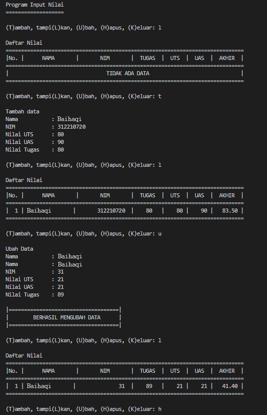
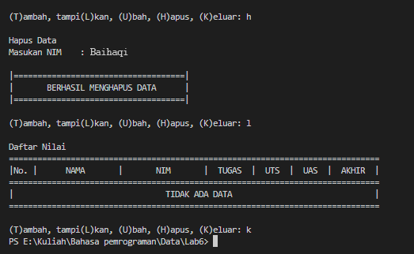

# Tugas Praktikum 6

<b>Nama : Baihaqi Asa'ari Lubis</b>

<b>NIM : 312210720</b>

<b>Prodi : Teknik Informatika</b>

<b>Mata Kuliah : Bahasa Pemrograman</b>

### Program Data Mahasiswa

Pada praktikum kali ini, kita akan membuat program sederhana untuk membuat data mahasiswa menggunakan fungsi dan Dictionary dengan python.

#### Program Praktikum

``` python
x = {}

def tambah():
    print("\nTambah data")
    nama = input("Nama           : ")
    nim = int(input("NIM            : "))
    uts = int(input("Nilai UTS      : "))
    uas = int(input("Nilai UAS      : "))
    tugas = int(input("Nilai Tugas    : "))
    akhir = tugas*30/100 + uts*35/100 + uas*35/100
    x[nama] = nim, tugas, uts, uas, akhir

def tampilkan():
    if x.items():
        print("\nDaftar Nilai")
        print("="*78)
        print("|No. |      NAMA       |       NIM       |  TUGAS  |  UTS  |  UAS  |  AKHIR  |")
        print("="*78)
        i = 0
        for z in x.items():
            i += 1
            print("| {no:2d} | {0:15s}| {1:15d}  | {2:5d}   | {3:5d} |{4:6d} | {5:7.2f} |"
                    .format(z[0][:13], z[1][0], z[1][1], z[1][2], z[1][3], z[1][4], no=i))
        print("=" * 78)
    else:
        print("\nDaftar Nilai")
        print("="*78)
        print("|No. |      NAMA       |       NIM       |  TUGAS  |  UTS  |  UAS  |  AKHIR  |")
        print("="*78)
        print("|                                TIDAK ADA DATA                              |")
        print("="*78)
    
def hapus():
    print("\nHapus Data")
    nama = input("Masukan Nama    : ")
    if nama in x.keys():
        del x[nama]
        print()
        print("|====================================|")
        print("|       BERHASIL MENGHAPUS DATA      |")
        print("|====================================|")
    else:
        print("NIM {0} Tidak Ditemukan".format(nama))

def ubah():
    print("\nUbah Data")
    nama = input("Nama           : ")
    if nama in x.keys():
        del x[nama]
        nama = input("Nama           : ")
        nim = int(input("NIM            : "))
        uts = int(input("Nilai UTS      : "))
        uas = int(input("Nilai UAS      : "))
        tugas = int(input("Nilai Tugas    : "))
        akhir = tugas*30/100 + uts*35/100 + uas*35/100
        x[nama] = nim, tugas, uts, uas, akhir
        print()
        print("|====================================|")
        print("|        BERHASIL MENGUBAH DATA      |")
        print("|====================================|")
    else:
        print("Nama {0} tidak ditemukan".format(nama))


print("Program Input Nilai")
print("="*19)
while True:
    c = input("\n(T)ambah, tampi(L)kan, (U)bah, (H)apus, (K)eluar: ")
    if c.lower() == 't':
        tambah()
    elif c.lower() == 'l':
        tampilkan()
    elif c.lower() == 'u':
        ubah()
    elif c.lower() == 'h':
        hapus()
    elif c. lower() == 'k':
        break
    else:
        print("Pilih menu yang tersedia")
```
### Hasil Output



#### Penjelasan 

1.) Pertama kita membuat sebuah dictionary kosong yang nantinya akan diinputkan data ketika program dijalankan.
```python
x = {}
```

2.) Lalu membuat fungsi untuk mentambahkan data
```python
def tambah():
    print("\nTambah data")
    nama = input("Nama           : ")
    nim = int(input("NIM            : "))
    uts = int(input("Nilai UTS      : "))
    uas = int(input("Nilai UAS      : "))
    tugas = int(input("Nilai Tugas    : "))
    akhir = tugas*30/100 + uts*35/100 + uas*35/100
    x[nama] = nim, tugas, uts, uas, akhir
```

3.) Membuat fungsi untuk mentampilkan data
```python
def tampilkan():
    if x.items():
        print("\nDaftar Nilai")
        print("="*78)
        print("|No. |      NAMA       |       NIM       |  TUGAS  |  UTS  |  UAS  |  AKHIR  |")
        print("="*78)
        i = 0
        for z in x.items():
            i += 1
            print("| {no:2d} | {0:15s}| {1:15d}  | {2:5d}   | {3:5d} |{4:6d} | {5:7.2f} |"
                    .format(z[0][:13], z[1][0], z[1][1], z[1][2], z[1][3], z[1][4], no=i))
        print("=" * 78)
    else:
        print("\nDaftar Nilai")
        print("="*78)
        print("|No. |      NAMA       |       NIM       |  TUGAS  |  UTS  |  UAS  |  AKHIR  |")
        print("="*78)
        print("|                                TIDAK ADA DATA                              |")
        print("="*78)
```

4.) Membuat fungsi untuk menghapus data
```python
def hapus():
    print("\nHapus Data")
    nama = input("Masukan Nama : ")
    if nama in x.keys():
        del x[nama]
        print()
        print("|====================================|")
        print("|       BERHASIL MENGHAPUS DATA      |")
        print("|====================================|")
    else:
        print("NIM {0} Tidak Ditemukan".format(nama))
```

5.) Membuat fungsi untuk mengubah data
```python
def ubah():
    print("\nUbah Data")
    nama = input("Nama           : ")
    if nama in x.keys():
        del x[nama]
        nama = input("Nama           : ")
        nim = int(input("NIM            : "))
        uts = int(input("Nilai UTS      : "))
        uas = int(input("Nilai UAS      : "))
        tugas = int(input("Nilai Tugas    : "))
        akhir = tugas*30/100 + uts*35/100 + uas*35/100
        x[nama] = nim, tugas, uts, uas, akhir
        print()
        print("|====================================|")
        print("|        BERHASIL MENGUBAH DATA      |")
        print("|====================================|")
    else:
        print("Nama {0} tidak ditemukan".format(nama))
```

6.) Lalu kita membuat kondisi perulangan dan sebuah keterangan untuk pilihan menu yang akan menjalankan program.

```python
while True:
    c = input("\n(T)ambah, tampi(L)kan, (U)bah, (H)apus, (K)eluar: ")
```

7) Membuat syntax untuk memanggil fungsi.
```python
if c.lower() == 't':
        tambah()
    elif c.lower() == 'l':
        tampilkan()
    elif c.lower() == 'u':
        ubah()
    elif c.lower() == 'h':
        hapus()
```
Apabila kita input 't' maka sistem akan memanggil fungsi tambah, bila kita input 'l' maka sistem akan memanggil fungsi tampilkan, bila kita input 'u' maka sistem akan memanggil fungsi ubah, bila kita input 'h' maka sistem akan memanggil fungsi hapus.

8) Membuat syntax untuk menghentikan perulangan.
```python
    elif c. lower() == 'k':
        break
```
Apabila kita menginput 'k' maka program akan langsung berhenti.

9) Membuat syntax untuk apabila memilih pilihan yang tidak ada di menu.
```python
    else:
        print("Pilih menu yang tersedia")
```
Jika kita menginputkan selain yang ada pada menu (t, l, u, h, k) maka kita akan diminta untuk memilih menu yang tersedia.
